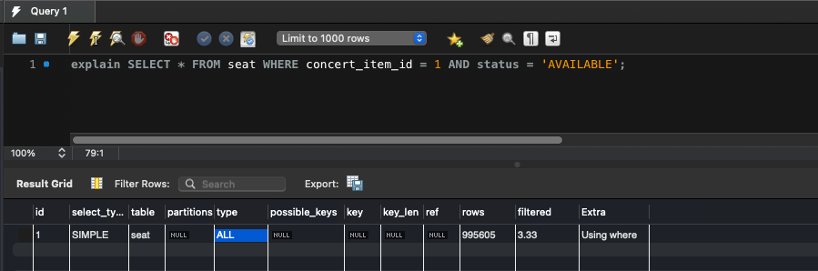

# 쿼리 성능 개선 보고서


## 1. 예약 가능한 날짜 조회

### 1.1 기존 쿼리 (인덱스 없음)
  ```sql 
	• 	쿼리:
		SELECT * FROM concert_item WHERE concert_id = 1 AND session_at > NOW();
	•	실행 계획:
		테이블 스캔(ALL)이 발생하여 전체 데이터를 확인함.
  ```


### 1.2 인덱스 추가 후 (복합 인덱스 concert_id, available_date)

  ```sql
	•	추가된 인덱스:
		CREATE INDEX idx_concert_id_available_date ON concert_item(concert_id, session_at);
	•	실행 계획:
		인덱스 스캔(range)을 사용
  ```


---

## 2. 좌석 조회

### 2.1 기존 쿼리 (인덱스 없음)

  ```sql
	•	쿼리:
		SELECT * FROM seat WHERE concert_item_id = 1 AND status = 'AVAILABLE';
	•	실행 계획:
		테이블 스캔(ALL)이 발생하여 전체 데이터를 확인함.
  ```



### 2.2 인덱스 추가 후 (복합 인덱스 concert_item_id, status)

  ```sql
	•	추가된 인덱스: CREATE INDEX idx_concert_item_id_status ON seat(concert_item_id, status);
	•	실행 계획:
		인덱스 스캔(ref)을 사용하여 성능 개선됨(cost 100690 -> 63.9).
  ```


	전체 데이터 100만건 중에서 조회하기 때문에, cost 상 성능에 유의미한 결과를 확인 할 수 있었습니다.

---

## 3. 좌석 예약

### 3.1 기존 쿼리 (인덱스 없음)
  ```sql
	•	쿼리:
		SELECT * FROM reservation WHERE user_id = 1 AND status = 'CONFIRMED';
	•	실행 계획:
		테이블 스캔(ALL)이 발생하여 전체 데이터를 확인함.
  ```


### 3.2 인덱스 추가 후 (복합 인덱스 user_id, status)
  ```sql
	•	추가된 인덱스:
		CREATE INDEX idx_user_id_status ON reservation(user_id, status);
	•	실행 계획:
		인덱스 스캔(ref)을 사용.
  ```


---

### 테스트 데이터
1000건의 콘서트, 2000건의 콘서트 아이템, 100만건의 좌석 더미 데이터를 생성하였습니다.


