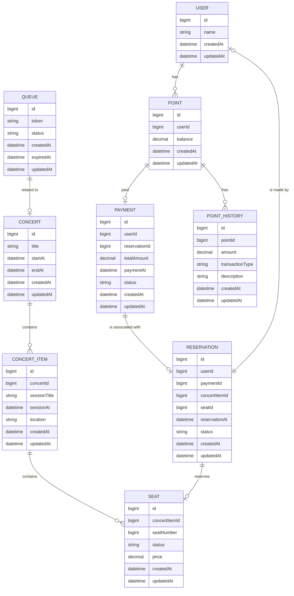

# ERD

```mermaid
erDiagram
    USER {
        bigint id
        string name
        datetime createdAt
        datetime updatedAt
    }

    QUEUE {
        bigint id
        string token
        string status
        datetime createdAt
        datetime expiredAt
        datetime updatedAt
    }

    CONCERT {
        bigint id
        string title
        datetime startAt
        datetime endAt
        datetime createdAt
        datetime updatedAt
    }

    CONCERT_ITEM {
        bigint id
        bigint concertId       
        string sessionTitle
        datetime sessionAt
        string location
        datetime createdAt
        datetime updatedAt
    }

    SEAT {
        bigint id
        bigint concertItemId
        bigint seatNumber
        string status
        decimal price
        datetime createdAt
        datetime updatedAt
    }

    PAYMENT {
        bigint id
        bigint userId    
        bigint reservationId    
        decimal totalAmount
        datetime paymentAt
        string status
        datetime createdAt
        datetime updatedAt
    }

    RESERVATION {
        bigint id
        bigint userId
        bigint paymentId
        bigint concertItemId
        bigint seatId
        datetime reservationAt
        string status
        datetime createdAt
        datetime updatedAt
    }

    POINT {
        bigint id
        bigint userId     
        decimal balance
        datetime createdAt
        datetime updatedAt
    } 
    
    POINT_HISTORY {
        bigint id
        bigint pointId     
        decimal amount
        string transactionType
        string description
        datetime createdAt
        datetime updatedAt
    }

    %% Relationships
    QUEUE ||--o| CONCERT : "related to"
    CONCERT ||--o{ CONCERT_ITEM : "contains"
    CONCERT_ITEM ||--o{ SEAT : "contains"

    POINT ||--o| PAYMENT : "paid"
    USER ||--o{ POINT : "has"
    POINT ||--o{ POINT_HISTORY : "has"
    PAYMENT ||--o| RESERVATION : "is associated with"


  RESERVATION ||--o| USER : "is made by"
  RESERVATION ||--o| SEAT : "reserves"
```