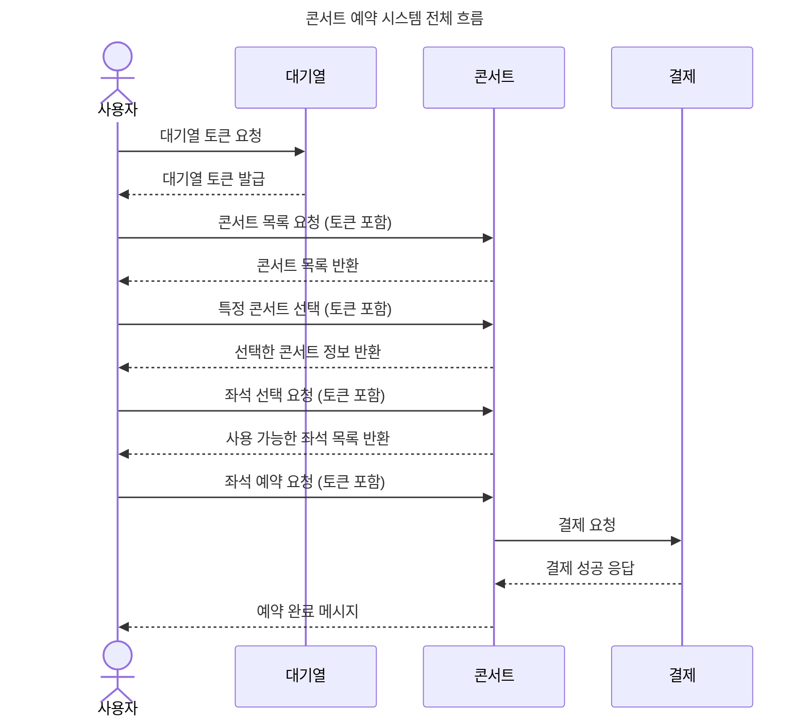
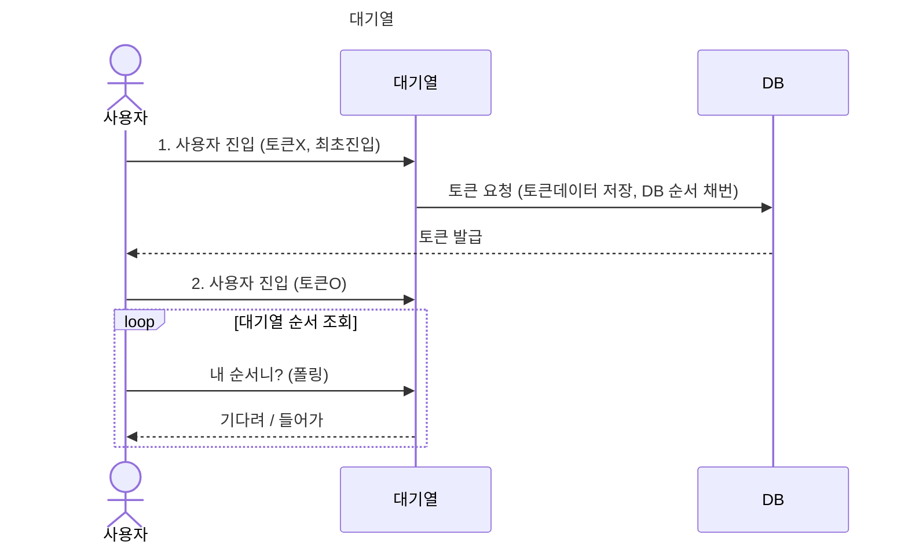
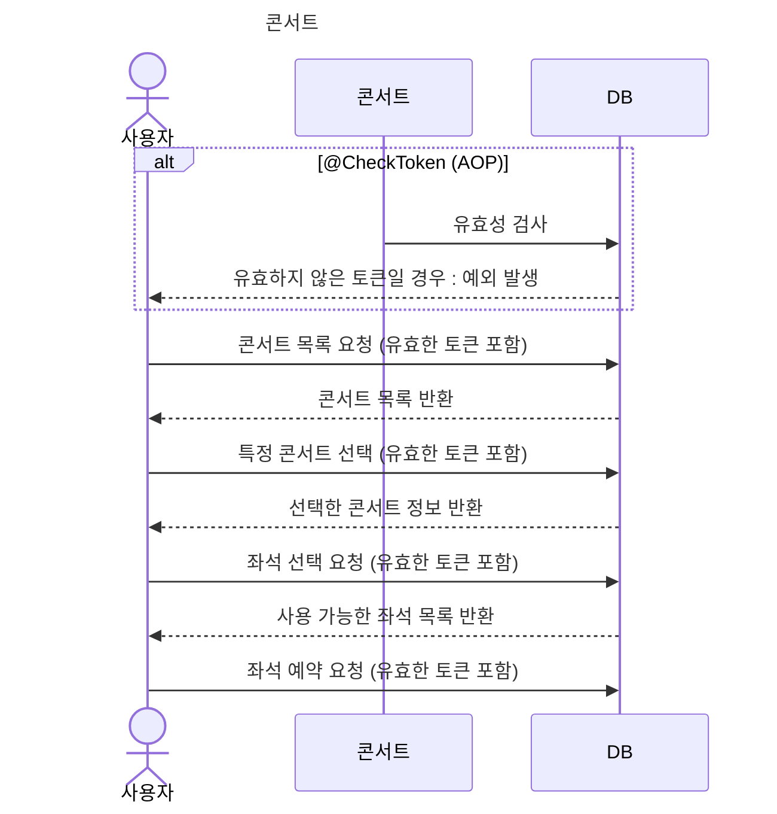
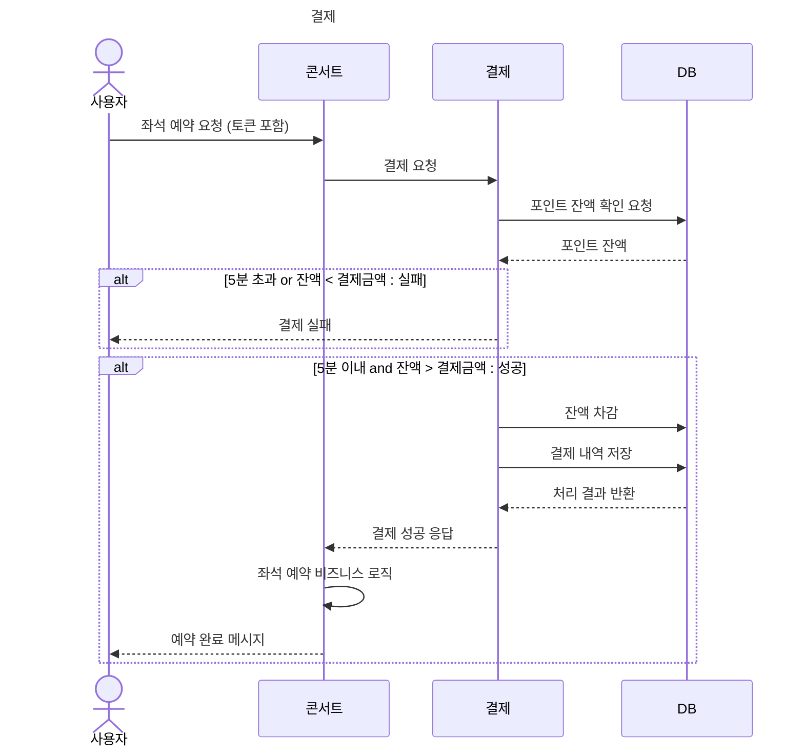
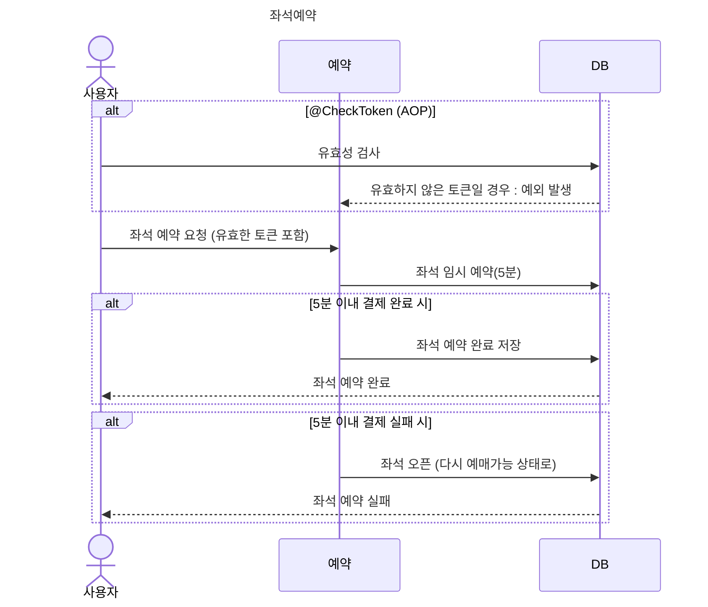
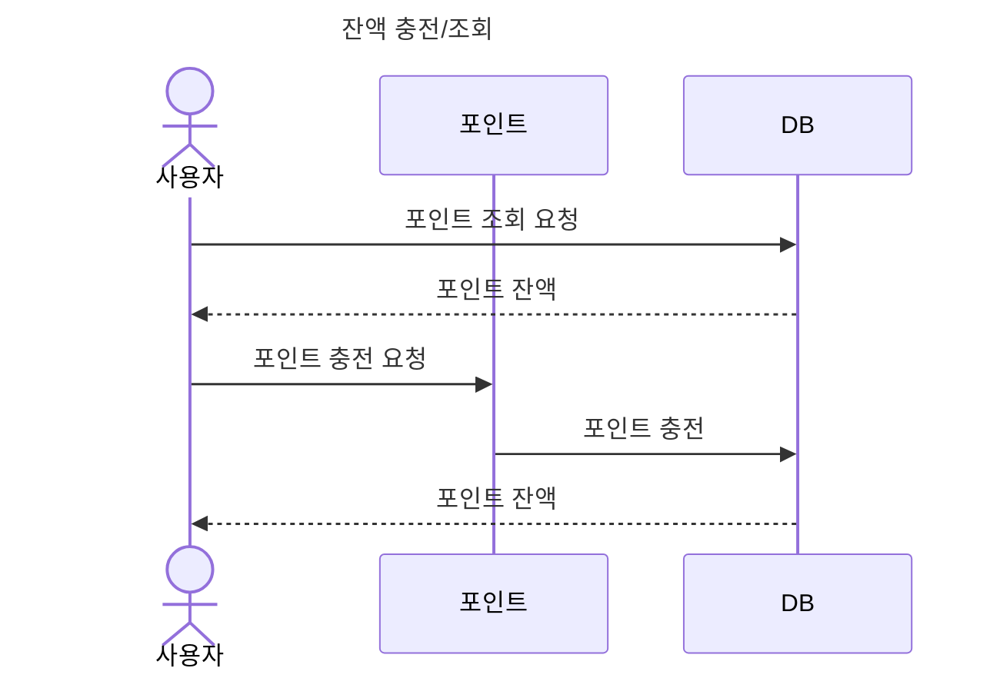

# 시퀀스 다이어그램

```text
대기열은 사용자의 토큰(번호표 역할)을 생성하고, 
줄을 세워서 입장 순서가 된 사용자를 콘서트 서비스에 접근하게 하는 유량 제어 역할을 담당합니다.
콘서트는 토큰을 가진 사용자의 콘서트 예메 서비스를 제공합니다.
결제 서비스는 유저의 포인트를 이용해서 콘서트 비용을 지불하여 예약을 완료합니다.
```














