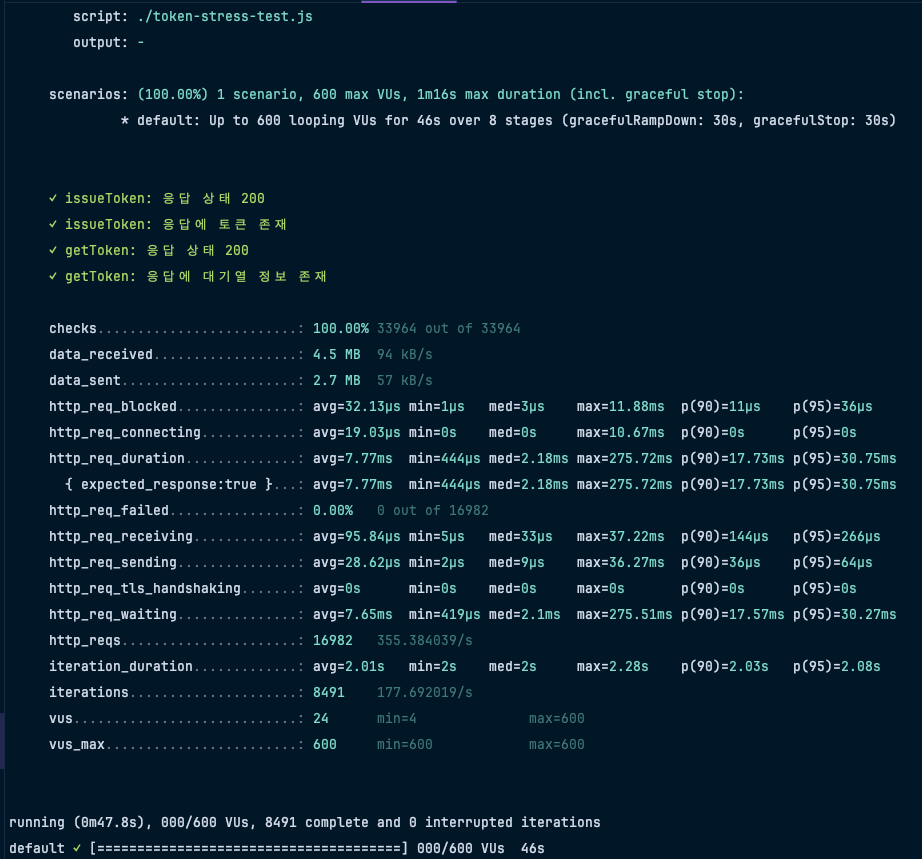

# 📊 부하 테스트 성능 보고서

## 1. 개요

이 보고서는 콘서트 예약 시스템의 성능을 평가하기 위해 수행된 부하 테스트 결과를 분석합니다. 

시스템의 안정성과 성능을 향상시키기 위한 향후 계획을 수립합니다.

## 2. 테스트 목표

    1.	성능 지표 평가
          •	응답 시간, 처리량, 에러율 등 핵심 성능 지표 측정.
    2.	병목 구간 식별
          •	시스템 부하로 인한 병목 구간 탐지 및 원인 분석.

## 3. 테스트 시나리오
### 1. 대기열 토큰 발급

   ### 테스트 시나리오 요약
   시나리오: 1개 시나리오 실행

   최대 VU (가상 사용자): 600명

   테스트 시간: 1분 16초 (46초 부하 상승, 30초 안정화 및 종료)

   총 요청 횟수: 33,964회 중 100% 성공
   ### 응답 상태 및 검증
   issueToken 요청: 응답 상태 200 확인 (성공)

   issueToken 요청에 필요한 토큰 존재 확인: 성공

   getToken 요청: 응답 상태 200 확인 (성공)

   getToken 요청에 대한 정보 존재 확인: 성공

   응답 실패율: 0% (16982개 요청 중 실패 없음)
   ### 주요 성능 지표
   총 수신된 데이터: 4.5MB
   총 전송된 데이터: 2.7MB

   요청당 평균 응답 시간: 7.77ms
   최소: 444μs
   최대: 275.7ms
   90% 응답 시간: 17.7ms
   95% 응답 시간: 30.75ms

   http_req_waiting (서버 응답 대기 시간): 7.65ms 평균
   최대: 275.5ms
   90%: 17.57ms
   95%: 30.27ms

   http_req_tls_handshaking: 평균 0ms (TLS 핸드셰이크 없음)
   ### 추가 지표
   데이터 차단 시간: 평균 32.13μs
   TCP 연결 시간: 평균 19.09ms
   데이터 수신 시간: 평균 95.84μs
   데이터 송신 시간: 평균 28.62μs
   총 요청 시간: 평균 2.01초
   최소: 2초
   최대: 2.28초
   90%: 2.03초
   95%: 2.08초
   ### 결론
   이 테스트는 최대 600명의 동시 사용자를 처리할 수 있음을 성공적으로 증명하였고, 응답 시간은 95%가 30.75ms 이하로 양호한 결과를 보였습니다. 

   요청 실패율은 **0%**로 안정적이며, 서버의 응답 대기 시간과 데이터 전송 시간도 최적화된 상태로 보입니다.

## 4.  향후 계획
  •	모니터링 : Grafana 대시보드 적용 및 실시간 경보 설정.

  •	추가 테스트: 더 높은 동시 사용자 수를 위한 부하 테스트 재실행.

  •	서킷 브레이커 도입: 장애 시 자동으로 서킷 상태 전환 기능 구현.
