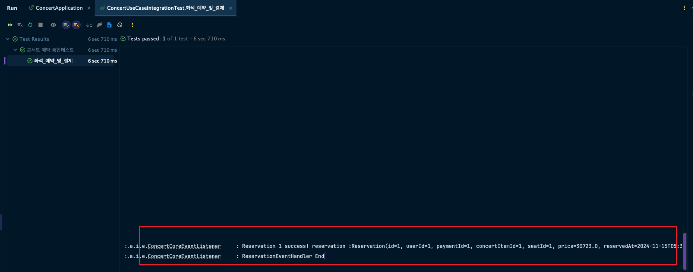

## 트랜잭션의 중요성과 느슨한 결합의 필요성

트랜잭션 범위는 서비스 단위 작업을 정의하는 범위로, 
데이터 일관성과 정확성을 보장하기 위해 트랜잭션이 어디까지 적용되어야 하는지 주된 관심사와 부가적인 관심사를 적절히 분리해야합니다.
예를 들어 외부 데이터 플랫폼을 이용하여 실행 결과(성공/실패) 메세지를 전송하거나, 이력 데이터를 저장하는 경우,
부가 기능의 실패가 롤백을 유발하여 주 기능의 실패로 이어진다면, 시스템의 중대한 결함을 초래하기 때문입니다.
기존 로직에 영향을 미치지 않도록 하는 것은 매우 중요합니다. 따라서 기존 트랜잭션 흐름에 최소한으로 개입시키는 느슨한 결합을 추구해야 합니다.

### 트랜잭션 관리방식
  - 단일 서비스 내 트랜잭션 : 기존 서비스가 단일 모듈에서 실행되는 경우, 트랜잭션을 한 서비스 내에서 관리합니다.
    좌석 예약과 결제 과정은 하나의 트랜잭션으로 묶이며, 만약 좌석이 매진되면 결제도 자동으로 롤백됩니다. 이로 인해 사용자는 실패한 상태가 아닌, 원래 상태로 되돌아가게 됩니다.
  - 복합 서비스 트랜잭션 : 서비스 확장시, 여러 마이크로서비스나 외부 시스템과의 상호작용이 필요할 수 있습니다. 
    이때, 분산 트랜잭션 또는 이벤트 기반의 처리방식이 필요합니다.
    좌석 예약이 성공했으나 결제 과정에서 네트워크 오류로 실패할 경우, SAGA 패턴을 통해 예약 정보를 취소하는 보상 트랜잭션이 자동으로 발행됩니다.

### 서비스 확장시 고려사항
- 부가 기능은 서비스의 가치와 확장성을 높여주지만, 이로 인해 주 트랜잭션의 실패로 이어지면 안 됩니다. 
따라서 주 기능의 성공 여부와 상관없이 부가 기능이 독립적으로 작동할 수 있도록 느슨한 결합을 통한 트랜잭션 처리가 필요합니다.

- 서비스 확장시 트랜잭션 처리는 분산 트랜잭션 또는 이벤트 기반 아키텍처를 통해 관리할 수 있습니다.
부가 기능을 추가할 때는 기존 로직을 변경하지 않도록 비동기적인 방식이나 메세지 큐를 활용하여 서비스의 일관성에 영향을 주지 않도록 합니다.
주 기능의 성공 여부에 따라 그 다음에 수행해야 할 동작을 지시하는 이벤트를 발행하는 이벤트 기반 아키텍처를 통해 관리할 수 있습니다.
트랜잭션 처리 한계에 대해서는 SAGA 패턴이나 보산 트랜잭션을 사용하여 문제를 해결하고, 서비스의 확장성과 안정성을 유지합니다.
    
    
        (요약)
        1.	서비스의 독립성과 일관성 유지: 확장 시 각 기능을 독립된 마이크로서비스로 분리하고, 필요한 경우 분산 트랜잭션과 이벤트 기반 아키텍처로 관리합니다.
        2.	최종 일관성 보장: SAGA 패턴과 보상 트랜잭션을 사용하여 복합 트랜잭션의 실패에 따른 복구 절차를 자동화하고, 각 서비스의 확장성을 유지합니다.
        3.	부가 기능 비동기화: 메시지 큐와 이벤트 발행을 활용하여 주 기능이 완료된 후 부가 기능을 실행하고, 주 기능의 안정성에 영향을 주지 않도록 합니다.
    

### 이벤트 기반 아키텍처
- 아래와 같이 서비스 내에서 사용되는 이벤트 인터페이스를 정의하고, 
구현체를 Spring 기반 이벤트 리스너를 구현 하거나 Kafka 기반 이벤트 리스너를 구현 하는 방식으로 이벤트를 처리 할 수 있습니다.
    
    ```java
    public interface ConcertEventListener<T extends Event> {
    
        void successReservationHandler(Reservation reservation) throws InterruptedException;
    }
    ```
    
    ```java
    public interface ConcertEventPublisher {
        
        void successReservation(Reservation reservation);
    }
    
    ```
---
(테스트 코드에서 이벤트 핸들러 동작 확인)
