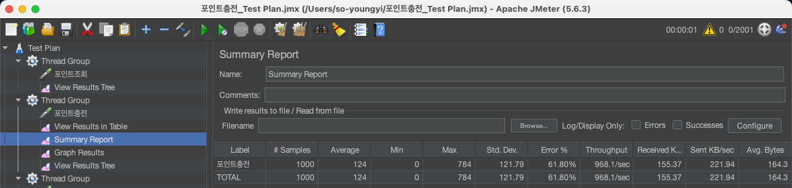
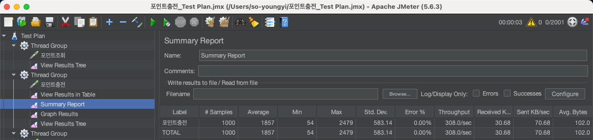
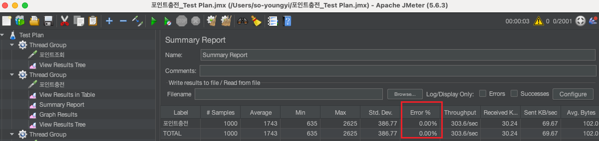

# 동시성 보고서

사용자 동시 접근이 많고 여러 인스턴스에서 동시에 접근이 일어날 수 있는 시스템에서는 적절한 동시성 제어가 필수적입니다. 
여기서는 콘서트 좌석 예약 서비스와 포인트 충전/차감 서비스라는 두 가지 주요 기능에서 발생할 수 있는 동시성 이슈를 효과적으로 해결하기 위한 전략을 제시하고, 각각의 특성에 맞는 락(lock) 방식을 선정하였습니다.

## 동시성 제어의 핵심 기준

아래 세 가지 주요 기준을 바탕으로 각 기능에 필요한 락 전략을 선정하였습니다.

	1.	다수 사용자의 동시 접근 빈도:
		여러 사용자가 동시에 자원을 요청하는 빈도가 높은 경우, 대기 시간이 길어지거나 충돌 가능성이 커질 수 있습니다.
	2.	실패 시 재시도 필요성:
		자원 확보 실패 시 재시도가 필요한 경우, 재시도에 따른 트랜잭션 처리 비용과 자원 소모를 고려해야 합니다.
	3.	데이터 정합성 요구 수준:
		정확한 데이터 일관성을 보장하는 것이 중요한 경우, 정합성을 우선으로 두고 락 전략을 선택해야 합니다.

### 1. 좌석 예약 서비스

    요구 사항 분석
    
        •	동시성 발생 가능성: 높음
        •	재시도 필요성: 낮음
        •	정합성 요구: 낮음 (예약 실패 시 재시도 불필요)
    
    좌석 예약 서비스는 여러 사용자가 동일 좌석을 동시에 예약하려고 할 수 있는 높은 동시성 상황을 갖습니다. 다만, 좌석 예약 실패 시 즉각적인 재시도나 대기 시간이 필요하지 않으므로 빠르게 응답을 반환하는 것이 중요합니다.
    
    해결 방안: 낙관적 락(Optimistic Lock) 적용
    
    낙관적 락은 잠금을 최소화하여 자원의 높은 접근성을 유지하는 방식으로, 충돌이 발생했을 경우 충돌한 사용자에게 즉시 오류를 반환하고 트랜잭션을 종료합니다. 이를 통해 사용자에게 빠른 응답을 제공하며, 재시도 로직 없이 바로 응답할 수 있어 서버 자원을 효율적으로 활용할 수 있습니다.
    
        •	장점: 높은 접근성, 빠른 응답 시간, 서버 부담 감소
        •	적용 근거: 좌석 예약 실패 시 추가적인 재시도가 필요하지 않으므로, 충돌 발생 시 빠르게 트랜잭션을 종료하는 방식이 효율적입니다.

### 2. 포인트 충전 및 차감 서비스

    요구 사항 분석
    
        •	동시성 발생 가능성: 낮음 (각 사용자가 자신의 포인트에 접근)
        •	재시도 필요성: 높음 (충돌 발생 시 정확한 처리가 중요)
        •	정합성 요구: 높음 (정확한 포인트 관리가 필수적)
    
    포인트 충전 및 차감 서비스는 각 사용자가 자신의 포인트에 접근하여 트랜잭션을 수행하므로 동시 접근 가능성은 비교적 낮지만, 정확한 처리와 재시도가 필요합니다. 충돌을 최소화하여 정합성을 보장하는 것이 중요하므로, 비관적 락(Pessimistic Lock)을 사용하여 접근 충돌을 방지하고자 합니다.
    
    해결 방안: 비관적 락(Pessimistic Lock) 적용
    
    비관적 락은 트랜잭션이 진행되는 동안 데이터에 대한 다른 트랜잭션 접근을 제한함으로써 높은 정합성을 보장합니다. 이를 통해 포인트의 정확한 충전 및 차감을 실현할 수 있으며, 충돌 발생 시 잠금을 통해 재시도를 유도합니다.
    
        •	장점: 정합성 보장, 재시도 유도 가능
        •	적용 근거: 데이터의 정확성을 우선시해야 하며, 충돌 발생 시 재시도가 필요하므로 비관적 락이 적합합니다.

## 확장성 고려: 다수 인스턴스와 분산 환경에서의 락 전략

  대규모 분산 환경에서 단일 데이터베이스에 락을 걸어 동시성을 제어하는 것은 성능 상 한계를 가질 수 있습니다. 
  수많은 사용자가 포인트 서비스에 접근할 경우, 단일 DB 락으로는 처리 대기 시간이 길어지거나 데이터베이스의 성능이 저하될 수 있습니다.
  
  따라서 Redisson 기반의 Redis 분산 락을 병행하여 락 대기 시간을 줄이고, 대규모 환경에서도 높은 성능과 데이터 정합성을 유지할 수 있습니다. 
  Redis 분산 락은 여러 인스턴스에서 접근을 제어하는 선제적인 대기열 역할을 할 수 있으며, 데이터베이스 접근 전 큐잉 메커니즘을 통해 트랜잭션 수를 조정하여 성능 최적화와 정합성을 보장합니다.
  
      •	장점: 대규모 환경에서 확장성 확보, DB 락 대기 시간 감소, 정합성 보장
      •	적용 근거: 분산 환경에서의 데이터 일관성과 트랜잭션 처리 효율성을 높이는 데 효과적입니다.

## 성능 평가
- 성능 평가를 위해 JMeter를 사용하여 각 락 방식을 대상으로 테스트를 수행할 수 있습니다. 
테스트 시, 각 기능별로 높은 동시성 하에서의 성능을 측정하며, 응답 시간, 오류율, 처리량을 비교해 성능을 정량화합니다.

- 포인트 충전/차감 서비스: 비관적 락 및 분산 락 성능 측정
  - 포인트 충전 낙관락
  

  - 포인트 충전 비관락
  

  - 포인트 충전 분산+낙관 락
  

## 결론

본 프로젝트에서는 시스템의 특성과 요구 사항에 맞춰 각각의 락 방식을 전략적으로 사용하여 성능을 최적화하였습니다. 
좌석 예약 서비스는 빠른 응답과 자원 활용 최적화를 위해 분산 락과 낙관적 락을 사용하며, 
포인트 충전 및 차감 서비스는 데이터 정합성과 충돌 관리의 중요성을 고려하여 비관적 락을 사용하여 안정적인 동시성 제어를 구현합니다.